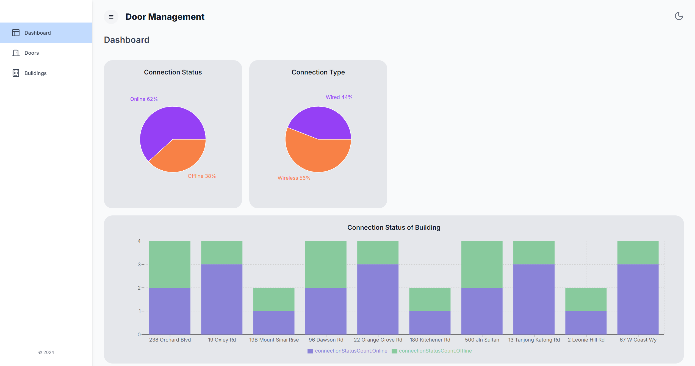
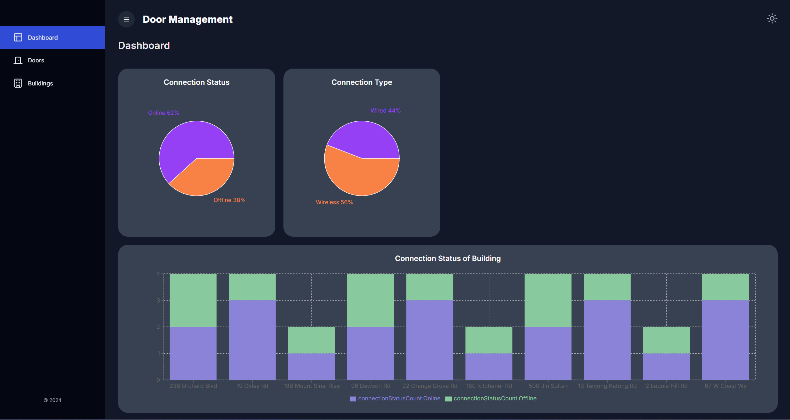

Live Demo: https://door-management.vercel.app/
# Door Management System

This is a web application designed to manage and monitor the status of doors in various buildings for a real estate company. The application is built using the BFF (Backend for Frontend) pattern with a Next.js and TypeScript stack, providing a clean, responsive UI along with data visualization capabilities.

## Technologies Used

- **Frontend**: `React`, `NextJS`, `TypeScript`
- **Styling**: `Tailwind CSS`
- **APIs**: `OpenWeatherMap API`
- **Charting**: `recharts`
- **Icon**: `lucide-react`
- **State Management/ API Request**: `Redux Toolkit Query`
- **Component Library**: `Material UI`, `x-data-grid`
- **Map**: `pigeon-maps`
- **Linter**: `ESLint`
- **Code Formatter**: `Prettier`
- **Datetime Lib**: `dayjs`
<!-- - **Jest**: Testing framework for JavaScript. -->
<!-- - **React Testing Library**: Library for testing React components from a user's perspective. -->


## Features
- **Door List**: A table displaying a list of doors with details such as door name, building name, connection type (wired or wireless), and connection status (online or offline).
- **Door Detail Page**: Detailed information about a specific door, including its name, building, connection type, and connection status.
- **Data Visualization**: Charts displaying the distribution of doors by building, connection type, and connection status.
- **Responsive Design**: The application is fully responsive, providing a seamless experience across devices.
- **Dark/Light Mode Toggle**: Switch between dark and light modes for better readability and user preference.

## Future Improvements
- Integration with real API endpoints for live data.
- Enhanced data visualization with more detailed analytics.
- Additional map features using Pigeon Maps for better location tracking of doors.

## Installation and Setup

### Prerequisites

Make sure you have the following installed on your machine:

- Node.js 18.17 or later.

*I'm using Node.j v20.15.0, npm v10.7.0*
### Steps to Run the Application Locally

1. **Clone the repository:**

    ```
    git clone https://github.com/hoeloon/door-management.git
    cd door-management/client
    ```
2. **Install dependencies:**
    ```
    npm install
    ```

3. **Env Setup:**
    1. Create a `/client/.env.local` file and add your API key:
    ```
    NEXT_PUBLIC_API_BASE_URL=https://door-management-api.vercel.app
    ```
4.  **Run the development server:**
    ```
    npm run dev
    ```
5.  **View the application:**
    Open your browser and navigate to http://localhost:3000 to view the application.

## Screenshots
*More screen can be found in `/screenshots` folder*


*Description: A screenshot of the main dashboard showing some chart*



*Description: A screenshot of the main dashboard in dark mode*
